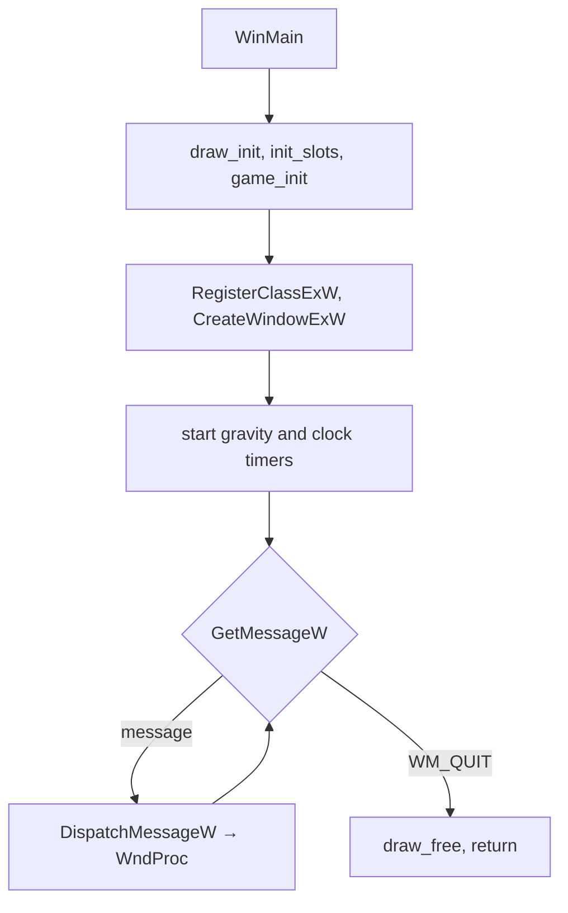
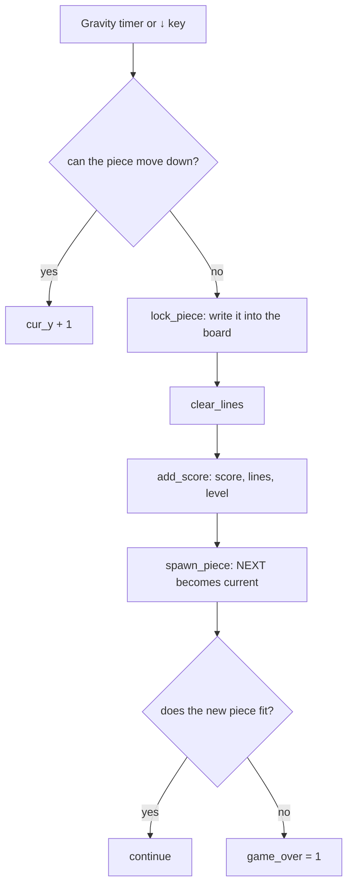

# Architecture

This document explains how the game is organized internally: how the source files fit together,
how a Windows program is driven by messages, how the game state is stored and how each frame is drawn.

## Source layout — unity build

Only `src/main.c` is compiled. It includes the other source files directly, so the whole program is
one translation unit:

```c
#define _CRT_SECURE_NO_WARNINGS
#include <windows.h>

#include "config.h"     // layout constants
#include "game.c"       // game rules, save / load
#include "draw.c"       // rendering
```

The order matters: `draw.c` uses the game state (`g`, `PIECES`) defined in `game.c`, and `main.c`
uses functions from both.

Because everything is compiled together, no header files with function declarations are needed.
Each file still has one clear responsibility:

| File | Depends on Windows? | Responsibility |
|---|---|---|
| `config.h` | no | Sizes, positions, timer IDs |
| `game.c` | **no** | Rules of the game, random pieces, save / load |
| `draw.c` | yes (GDI) | Turns the game state into pixels |
| `main.c` | yes | Window, messages, input, timers, painting pipeline |

`game.c` uses only the standard C library (`stdio.h`, `string.h`, `stdint.h`). It knows nothing
about windows, keys or pixels, so it can be compiled and tested on any platform.

## Program flow

A Windows program does not run in a loop of its own. After creating the window, `WinMain` waits
for messages and passes each one to `WndProc`. Every action in the game is a reaction to a message.



| Message | Handler | What happens |
|---|---|---|
| `WM_TIMER` (`TIMER_ID`) | `on_timer` | Gravity: `step_down` moves the piece one row |
| `WM_TIMER` (`CLOCK_ID`) | `on_timer` | `g.game_time` increases by one second |
| `WM_KEYDOWN` | `on_key` | Moves, rotates, drops, pauses, saves, loads |
| `WM_PAINT` | `on_paint` | Draws the whole scene |
| `WM_SIZE` | `WndProc` | Pauses the game when minimized |
| `WM_GETMINMAXINFO` | `WndProc` | Prevents the window from shrinking below its default size |
| `WM_ERASEBKGND` | `WndProc` | Ignored (returns 1) to avoid flicker |
| `WM_DESTROY` | `WndProc` | Stops the timers and quits |

Logic and drawing are kept separate. Timers and keys only change `g` and then call
`InvalidateRect`; the actual drawing happens only in `WM_PAINT`, which renders whatever the state
currently is.

After every action `sync_timer` compares the current level with the level the gravity timer was
set for, and restarts the timer with the new speed when the level has changed.

## Game loop



The gravity interval is `800 − 70 × level` milliseconds, with a minimum of 100 ms
(`gravity_interval_ms`). The level is `lines / 10`.

## Data

### Game state

The entire game is one global struct, `GameState g`:

```c
typedef struct {
    uint32_t magic;             // file signature
    int32_t  cur_type;          // current piece 0-6
    int32_t  cur_rot;           // rotation 0-3
    int32_t  cur_x;             // column of the 4x4 box (may be negative)
    int32_t  cur_y;             // row of the 4x4 box, hidden rows included
    int32_t  next_type;
    int32_t  score, lines, level, game_time, game_over, paused;
    uint32_t seed;
    int32_t  bag_pos;
    uint8_t  bag[7];
    uint8_t  board[TOTAL_ROWS][COLS];
} GameState;
```

Fixed-size types (`int32_t`, `uint8_t`) are used so that the layout, and therefore the save file
format, is the same for 32-bit and 64-bit builds.

### Board

`g.board` is 22 rows × 10 columns. Rows 0–1 are hidden (pieces spawn there), rows 2–21 are visible.

- `0` — empty cell
- `1`–`7` — occupied, the value is the color index (I, O, T, S, Z, J, L)

### Piece table

```c
const int8_t PIECES[7][4][4][2];   // [shape][rotation][cell] = { x, y }
```

Each cell is an `(x, y)` position inside a 4 × 4 box. Rotating a piece only changes `cur_rot`;
the table already contains all four orientations.

### Randomizer

A 7-bag: the bag is filled with the numbers 0–6, shuffled with Fisher–Yates, and emptied one piece
at a time. Random numbers come from a linear congruential generator
(`seed = seed × 1103515245 + 12345`) seeded with `GetTickCount` at startup. The seed is part of the
game state, so a loaded game continues with the same sequence.

## Core functions

### game.c

| Function | Description |
|---|---|
| `can_place(type, rot, x, y)` | Returns 1 if the piece fits: inside the board and on empty cells. Used by every other rule. |
| `try_move(dx, dy, drot)` | Applies the move only if `can_place` allows it. Returns 1 on success. |
| `rotate_piece()` | Rotates clockwise and tries the horizontal offsets 0, −1, +1, −2, +2 (wall kicks). |
| `step_down()` | Moves down one row; if impossible, locks the piece, clears lines, scores and spawns the next one. |
| `hard_drop()` | Moves down until blocked (2 points per row), then locks. |
| `lock_piece()` | Writes the current piece into the board. |
| `clear_lines()` | Removes full rows from the bottom up with `memmove`. Returns the number removed. |
| `add_score(n)` | Updates score, lines and level. |
| `spawn_piece()` | Takes `next_type`, draws a new one from the bag, sets `game_over` if the piece does not fit. |
| `new_game()` | Resets the state (keeping the random seed). |
| `save_slot`, `load_slot`, `init_slots` | Save system, see below. |

### draw.c

| Function | Description |
|---|---|
| `draw_init()` / `draw_free()` | Create and delete brushes and fonts. |
| `draw_scene(dc)` | Draws everything: background, board, current piece, panel, overlay. |
| `draw_cell(dc, x, y, color)` | One block: main color, light stripe on top, dark stripe at the bottom. |
| `draw_piece_at(dc, type, rot, px, py, min_y)` | A whole piece at pixel coordinates; cells above `min_y` are skipped (hidden rows). |
| `draw_panel(dc)` | NEXT, TIME, SCORE, LEVEL, LINES, SLOTS and the controls help. |
| `draw_overlay(dc)` | The PAUSED / GAME OVER band. |

## Rendering

Each `WM_PAINT` follows the same steps (`on_paint`):

1. Create an off-screen bitmap the size of the window's client area (**double buffering**).
2. Fill it with the background color.
3. Switch the memory DC to `MM_ANISOTROPIC` and map the game's fixed logical size
   (`CLIENT_W × CLIENT_H`) onto the largest centered rectangle with the same aspect ratio.
   All drawing code works in fixed coordinates; GDI does the scaling, so text stays sharp at any
   window size.
4. Call `draw_scene`.
5. Copy the finished image to the screen with one `BitBlt`.

Because the image is built off-screen and copied at once, the screen never shows a half-drawn
frame, which removes flicker.

## Save format

A save file is the raw bytes of `GameState`, written with one `fwrite`: 284 bytes
(283 bytes of data plus 1 byte of padding added by the compiler).

When a file is loaded it is first read into a temporary struct and checked by `state_is_valid`:
the signature must be `"TTC1"`, the piece types, rotation, bag and board values must be in range.
Only a valid file replaces the current game, so a damaged file or a save from the assembly
version (signature `"TTR1"`) cannot crash the game.

## Comparison with the assembly version

Both versions implement the same game with the same algorithms and the same file structure.

| | Assembly (Tetris v1) | C (this version) |
|---|---|---|
| Source size | ~2000 lines | ~790 lines |
| Function calls | manual `push` / `call` / `ret N` | normal function calls |
| Registers and stack | managed by hand | managed by the compiler |
| Game state | variables between two labels | one `struct` |
| Win32 declarations | `externs.inc`, `win32constants.inc` | `<windows.h>` |
| Save validation | size and signature | size, signature and value ranges |

## Adding a feature

A typical change touches three places:

1. **State** — add a field to `GameState` in `game.c` (this changes the save format),
   or a constant in `config.h`.
2. **Logic** — change it in `game.c`, or react to a key or timer in `main.c`.
3. **Drawing** — show it in `draw_panel` or `draw_board` in `draw.c`.
