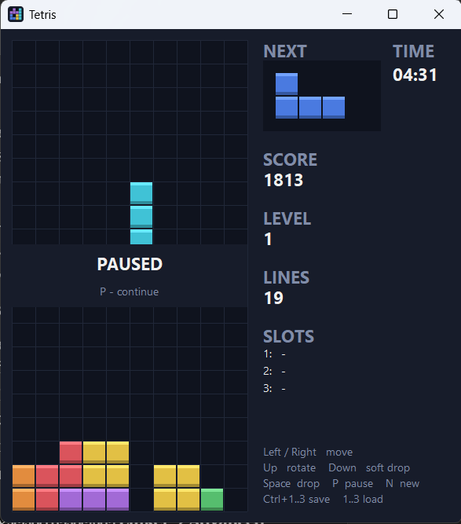

# Tetris — C (Win32)

A complete Tetris game written in C using the raw Win32 API and GDI.
No frameworks and no external libraries: only `kernel32`, `user32` and `gdi32`.

This is the C version of [Tetris v1](https://github.com/levanikotorashvili20-spec/Tetris-v1),
which implements the same game in x86 assembly.

## Download

Ready-to-run builds are available on the [Releases](../../releases) page.
The game runs on Windows 10/11 and needs no additional runtime libraries.

## Features

- 10×20 board with 2 hidden spawn rows
- 7 tetrominoes with 4 rotations each and simple wall kicks
- 7-bag randomizer (every 7 pieces contain each shape once)
- NEXT preview, SCORE, LEVEL, LINES and TIME
- Levels: the game speeds up every 10 lines
- Pause, and auto-pause when the window is minimized
- 3 save slots stored in files (`slot1.sav` … `slot3.sav`), validated on load
- Double-buffered rendering (no flicker)
- Resizable/maximizable window: the game scales and keeps its aspect ratio

## Controls

| Key | Action |
|---|---|
| ← / → | Move |
| ↑ | Rotate |
| ↓ | Soft drop |
| Space | Hard drop |
| P | Pause / continue |
| N | New game |
| Enter | New game (after game over) |
| Ctrl + 1 / 2 / 3 | Save to slot |
| 1 / 2 / 3 | Load from slot |
| Esc | Exit |

## Scoring

| Lines cleared at once | Points |
|---|---|
| 1 | 40 × (level + 1) |
| 2 | 100 × (level + 1) |
| 3 | 300 × (level + 1) |
| 4 | 1200 × (level + 1) |

Soft drop gives 1 point per row and hard drop gives 2 points per row.

## Building

Requirements: Visual Studio 2022 or newer with the **Desktop development with C++** workload.

1. Open the `.slnx` file.
2. Select the configuration (`Debug` or `Release`) and the platform (`x86` or `x64`).
3. Build with **Build → Build Solution**.

The project is a **unity build**: only `src/main.c` and `src/tetris.rc` are part of the project.
`main.c` pulls in the other source files with `#include`, so the whole program is compiled as a
single unit. The included `.c` files must **not** be added to the project, otherwise they are
compiled twice and the linker reports duplicate symbols.

Project settings used (for all configurations and platforms):

- Linker → System → SubSystem: `Windows`
- C/C++ → Code Generation → Runtime Library (Release): `Multi-threaded (/MT)` —
  links the C runtime statically, so the executable does not depend on `VCRUNTIME140.dll`

## Project structure

| File | Contents |
|---|---|
| `src/main.c` | Entry point (`WinMain`), window, message loop, keyboard, timers, painting |
| `src/game.c` | Game logic: collision check, movement, rotation, line clearing, scoring, save/load |
| `src/draw.c` | Drawing: cells, pieces, side panel, pause / game over overlay |
| `src/config.h` | Layout constants and timer IDs |
| `src/tetris.rc`, `src/tetris.ico` | Application icon |

## How it works

A detailed description of the internals is in [ARCHITECTURE.md](ARCHITECTURE.md). In short:

- **Board** — `uint8_t board[22][10]`; `0` = empty, `1–7` = piece color.
- **Pieces** — a table `PIECES[7][4][4][2]`: 7 shapes × 4 rotations × 4 cells × `(x, y)`.
- **`can_place`** — the core function. Moving, rotating, dropping and game-over detection all ask
  whether a piece fits at a given position.
- **Game loop** — a Windows timer moves the piece down. When it can no longer move, it is written into
  the board, full lines are removed, the score is updated and the next piece spawns.
- **Saving** — the whole game state is one `GameState` struct, so a save is a single `fwrite`
  and a load is a single `fread`.

## License

This project is licensed under the MIT License — see [LICENSE](LICENSE).
